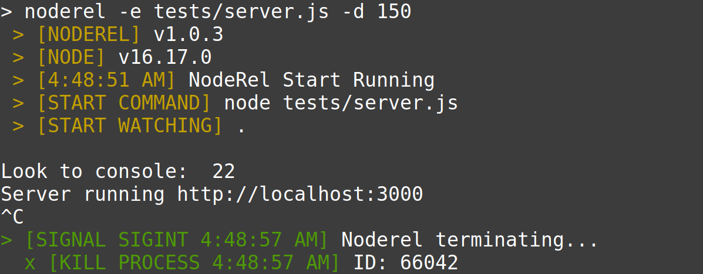

# ↻ ♾️ NodeRel
NodeRel is a tool that automatically restarting the node application when file changes.

 

- Fast and simple to use.
- Automatic re-running.
- Manual restarting.
- Monitoring multiple directories.
- Ignoring files.
- Delaying restarting.

# Installation
```shell
npm install -g noderel 
# yarn global add noderel
```

## CLI
```shell
# all configs are optional 
noderel --entry bin/server.js --watch routes,app --wait 150 --verbose=false --allow-restart=true
```

## API
```js
const noderel = require('noderel');

noderel(configuration?: Object): void
```

## Configuration

| Prop     | Default                          | Description                   |
|----------|----------------------------------|-------------------------------|
|entry     | `(package.json).main`            | Set entry file |
|watch     | `.`                              | Set the watch directories or files. |
|ignore    | `/node_modules\|(^\|[\/\\])\../` | which\'s files or folders should be ignored |
|wait      | `100`                            | Realod time between changes (ms). |
|verbose   | `true`                          | Show logs |
|allow-restart | `false` | allow restart when typing `rs`|

## Config file
```json
// noderel.json
// A config file can take any of the command line arguments as JSON key values, for example:
{
  "entry": "tests/server.js",
  "watch": ["src", "bin"],
  "ignore": "**/{node_modules,tests,dist,temp,.git}/*",
  "wait": 150,
  "verbose": true,
  "allowRestart": false
}
```

## Capture


# License
